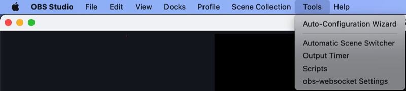

# RotorHazard OBS Websocks Control Plugin
This system allows RotorHazard to communicate to [OBS Studio](https://obsproject.com/) video application and control the video remotely. The Rotohazard "start race" and "stop race" events will start and stop the video recording automatically.

This software is distributed as a plugin to be added to the RotorHazard.

## Features
* OBS customized filename saving. Sample filename Template: "%CCYY%MM%DD/%class-%heat-%round"
* Start recording before the race starts, for (parameter in milliseconds) 
* Restart the connection to OBS in case of a failed call to the Webservice.
* A start/stop recording failure raises a high-priority message in the front end.

## Also
 * Not required to restart the RH/Raspberry Pi
 * Retro compatibility to WebSocket API v4.(by the docs)

## Tested on:
 * Obs-websocket Version: 5.5.6, OBS Studio Version: 31.0.3
 * OBS WebSocket Version: 5.4.2, OBS Studio Version: 30.1.0
 * OBS WebSocket Version: 5.0.1, OBS Studio Version: 27.2.4

## USE CASES
* Control OBS Studio to save the race video.
* Start recording before the race ( helps detect false starts )


## Compatibility chart
The current version requires  RHAPI 1.3 fowerd, starting at RotorHazard versions 4.3.1

## Installation and Setup

The system comprises a RotoHazard plugin and the OBS Studio software for video recording.

### Install Plugin

The recommended method for installation is through the RH UI, specifically the Plug-Ins page. 


Manual installation, at the files level, can be achieved by copying the `obs_control` plugin into the custom `plugins` directory in your RotorHazard.
Install dependencies. File available inside the plugin directory.
```
    pip install -r .\requirements.txt
```
### Configure Plugin

The configuration must now be done through the UI. The data is persisted in the `config.json` file.

Set your OBS parameters like IP, port, password, and file name template.

The plug-in adds custom Rotorhazard placeholders to the ones used by OBS:
 * %class
 * %heat
 * %round
 * %classId
 * %heatId

Sample configs for filename: 
 - %CCYY%MM%DD_%class-%heat-%round
 - %CCYY%MM%DD/%heat-%round ( Includes creation of directory )
 - %CCYY-%MM-%DD_%hh-%mm-%ss_CAAR_%class-%heat-%round


This plug-in can be active/inactive by setting the parameter ENABLED accordingly.

Note: The enabled checkbox is failing to reflect the real status of the ENABLED parameter. The situation is identified, and the correction can be tracked at the issue [RH1073](https://github.com/RotorHazard/RotorHazard/issues/1073).

The recording can be activated before the race starts by setting the parameter PRE_START with an int value (milliseconds) to the start. Note that the waiting is done in intervals of 0,1 seconds (100 ms).

### TroubleShoot

* When in doubt, refresh the connection by resetting the checkbox, followed by the buttons Disable and Connect.


### On the OBS app

Go to tools > obs-socket_sething



Then, set the server port and the password. 


